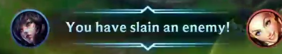

# LOL's Hero Recognition

League of Legends: Wild Rift (a.k.a Wild Rift) is an mutiplayer online battle arena game developed by Riot Games. In the highlight moment detection systems, it is important to recognize the hero appearing on the message bar when a battle happens.

### This repository will detect hero name from the screenshot capture.

### From:


### To: "Ahri"

## How can i do it?

#### 1 Image detection and crop.
I was use OpenCV library to detection circle shape and rectangle shape, after that i crop the image follow the shape.
#### 2 Prepare dataset
Combine data from step 1 and a part crawl from LoL page. Has been compiled in the data directory
#### 1 Recognition.
I just used basic pretrained ResNet18 model. Modify to match the dataset.

## How to use?
#### Installation
```bash
$ git clone https://github.com/RC-Sho0/LOL-Hero-Detection.git
$ cd LOL-Hero-Detection
$ pip install -r requirements.txt
```

#### Prediction
**You need to prepare the data folder you want to predict like "/alldata/test_data/test_images".**

```bash
python predict.py --input_path <your_path> --output_path <path_of_predict>
```


### All done!

----------
If you like that, please Star my repo 🌟

And if you want to support let follows my github 🎆

Authorized by Sho0

